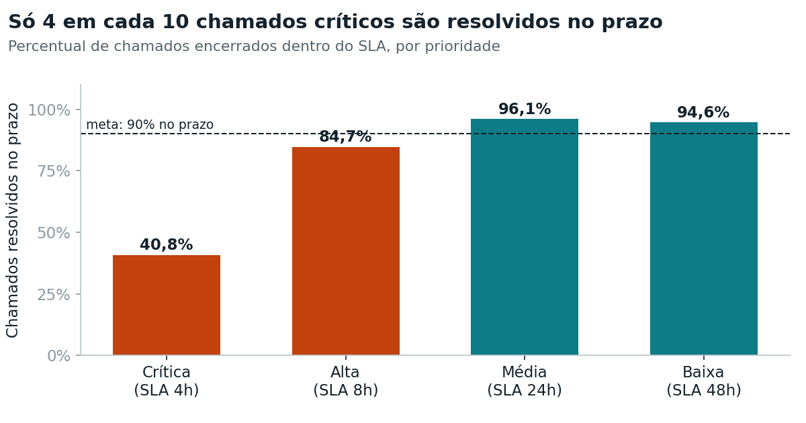
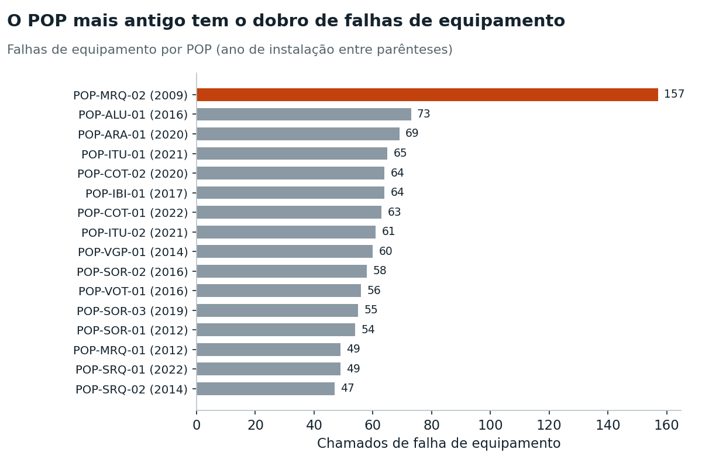
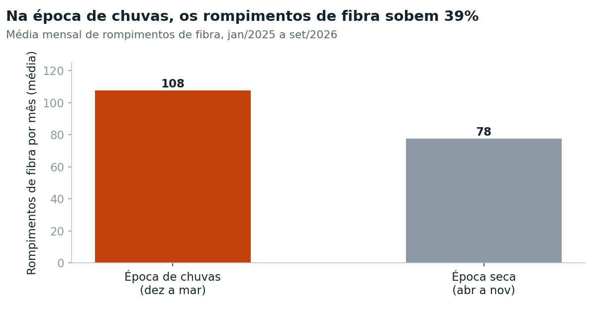
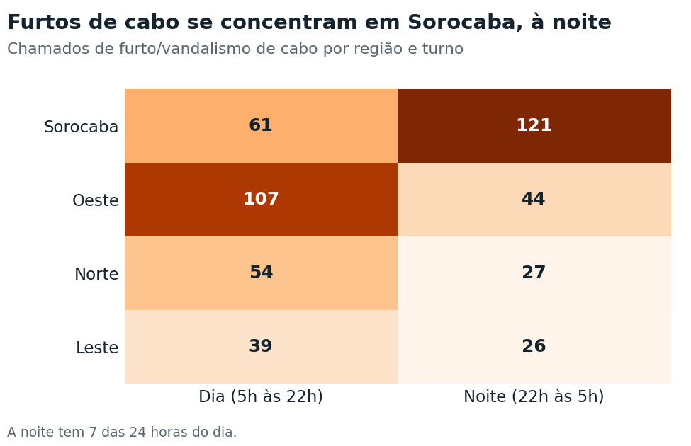

# 🛠️ Análise de Chamados de Manutenção de Rede com SQL

Análise em **SQL** de 6.000 chamados de manutenção de uma rede de fibra óptica na região de São Roque (SP), para responder à pergunta da gerência de operações: **onde, quando e por que a rede falha, e o prazo de atendimento (SLA) está sendo cumprido?**




---

## 📌 Contexto

Trabalhei mais de 12 anos em manutenção de redes de fibra óptica, atendendo rompimentos, falhas de equipamento em POPs e chamados de clientes empresariais. Este projeto aplica SQL a esse universo.

> A base é **fictícia**, gerada pelo script `gerar_base.py` para fins de estudo, mas foi desenhada a partir de situações reais do dia a dia de manutenção: sazonalidade de rompimentos, equipamentos no fim da vida útil, furto de cabos e pressão de SLA. Nomes de técnicos e clientes são inventados.

## 🗂️ A base de dados

| Tabela | Linhas | Conteúdo |
|---|---:|---|
| `chamados` | 6.000 | Abertura, início e encerramento do atendimento, tipo de falha, causa raiz, prioridade, SLA, distância da falha (OTDR), perda em dB e status |
| `pops` | 16 | Pontos de presença: cidade, região e ano de instalação |
| `tecnicos` | 18 | Nível (Júnior, Pleno, Sênior) e equipe |
| `clientes` | 400 | Segmento (Empresarial ou Residencial), plano e valor mensal |

Período: janeiro de 2025 a setembro de 2026.

## 🧰 Técnicas de SQL usadas

- `SELECT`, `WHERE`, `ORDER BY`, `LIMIT`
- Agregações: `COUNT`, `AVG`, `SUM`, `GROUP BY`, `HAVING`
- `JOIN` entre as 4 tabelas
- `CASE WHEN` para criar categorias (turno, época do ano)
- Datas com `strftime()` e `julianday()`
- **CTEs** (`WITH`) para organizar consultas em etapas
- **Funções de janela:** `RANK() OVER (PARTITION BY ...)` e `LAG()`
- **VIEW** com os dados limpos e as colunas de tempo calculadas, reaproveitada em todas as análises
- **Limpeza de dados:** tipos de falha digitados de forma inconsistente e causas não preenchidas

Todas as 16 consultas estão em [`consultas.sql`](consultas.sql), comentadas, e as perguntas de negócio em [`perguntas.md`](perguntas.md).

## 🔍 Principais descobertas

### 1. O SLA dos chamados críticos está longe da meta
Só **40,8%** dos chamados críticos (SLA de 4 horas) são resolvidos no prazo, contra 84,7% dos de prioridade alta e mais de 94% dos de prioridade média e baixa. Em média, um chamado crítico leva **5,2 horas** para ser resolvido.

### 2. Os clientes que mais pagam são os pior atendidos
Os clientes **empresariais** têm SLA cumprido em **66,1%** dos chamados, contra 78,9% dos residenciais. Eles são 120 dos 400 clientes, mas respondem por **R$ 198 mil dos R$ 233 mil** de receita mensal (85%).

### 3. Um POP antigo concentra falhas de equipamento


O **POP-MRQ-02** (Mairinque), instalado em 2009, teve **157** falhas de equipamento, mais que o dobro de qualquer outro POP. É um forte indício de equipamentos no fim da vida útil.

### 4. A chuva aumenta os rompimentos de fibra


De dezembro a março, a média sobe de **78 para 108 rompimentos por mês** (+39%).

### 5. Furto de cabo tem região e horário


**Sorocaba à noite** concentra 121 ocorrências de furto e vandalismo de cabo, a maior combinação de região e turno, mesmo a noite tendo só 7 das 24 horas do dia.

### 6. A experiência do técnico pesa no reparo
Em rompimentos de fibra, técnicos **júniores** levam em média **5,9 horas** para reparar, contra 4,3 dos plenos e 3,6 dos sêniores. A **Equipe Sorocaba**, com 5 júniores entre 6 técnicos, tem o pior SLA (69,0%) justamente na região com mais furtos.

### 7. Quase 1 em cada 5 chamados é reincidente
**1.099 chamados (18,3%)** foram abertos pelo mesmo cliente até 7 dias depois de um chamado anterior, sinal de que parte dos problemas não é resolvida na primeira visita.

## ✅ Recomendações

| Problema | Ação proposta |
|---|---|
| SLA crítico em 40,8% | Plantão dedicado a chamados críticos e equipes de prontidão nos horários de pico |
| Clientes empresariais mal atendidos | Priorizar o segmento empresarial na fila e criar um indicador de SLA por segmento |
| POP-MRQ-02 com o dobro de falhas | Plano de troca dos equipamentos do POP, com custo comparado ao das falhas |
| Rompimentos na época de chuvas | Poda preventiva e inspeção da rede aérea antes de dezembro |
| Furtos em Sorocaba à noite | Monitoramento noturno e reforço de segurança nos trechos mais atingidos |
| Equipe Sorocaba com perfil júnior | Rever a distribuição de técnicos sêniores e investir em treinamento |
| 18,3% de reincidência | Checklist de encerramento e análise de causa raiz nos clientes reincidentes |

## 📁 Estrutura

```
analise-chamados-sql/
├── chamados_rede.db   # banco SQLite (tabelas + view vw_chamados)
├── consultas.sql      # as 16 consultas, comentadas
├── perguntas.md       # perguntas de negócio respondidas
├── gerar_base.py      # script que gera a base fictícia
└── imagens/           # gráficos das descobertas
```

## ▶️ Como reproduzir

1. Instale o [DB Browser for SQLite](https://sqlitebrowser.org/) (gratuito)
2. Abra o arquivo `chamados_rede.db`
3. Na aba **Executar SQL**, cole e rode as consultas do `consultas.sql`

Para gerar a base do zero:

```bash
pip install pandas numpy
python gerar_base.py
```

---

👤 **Alessandro José dos Santos** · [LinkedIn](https://www.linkedin.com/in/alessandro-jos%C3%A9-dos-santos-01b87a127) · [Portfólio](https://alessandromaxv10.github.io)
